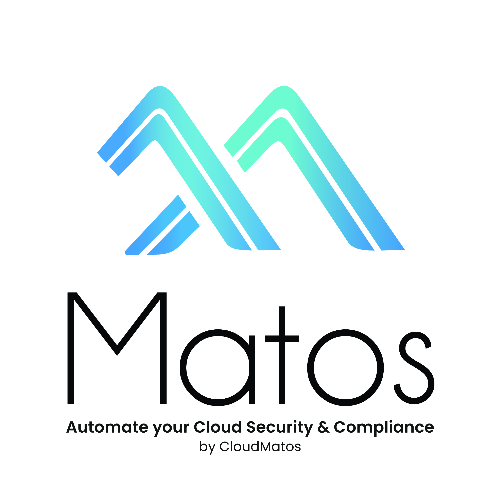

# Contributing Guidelines for Matos

The developer guide is for anyone wanting to contribute directly to the Matos project. We welcome all contributions, suggestions, and feedback, so please do not hesitate to reach out! If you've already developed new functionality we'd be happy to take a look at them and merge them as part of the [Matos][MatosCommunity] [repsitory][MatosGitHub].

Before you contribute, please take a moment to review and agree to abide by our community [Code of Conduct](./CODE_OF_CONDUCT.md)

## Report issues

Matos is an open source project maintained by [CloudMatos][CloudMatos]. We have dedicated maintainers developing new content and adding more features. If you have a bug or an idea, start by opening an [issue][MatosIssues]. Try to make it as descriptive as possible.

## Developing and contributing code

Dedicated Cloud Matos maintainers are actively developing new content and adding more features. We would be delighted to chat and look at your code. Here are a few guidelines we follow. Hopefully, these will ensure your contribution could quickly be added to the project.

### Work locally

Most Matos users/contributors run their own local instances of Matos and run it manually. As Matos is a non-intrusive library we recommend developing against a local repository and ensuring you are able to add your contributions successfully on your local fork/repo.

If you are developing against remote libraries or repositories - that's great! We'd love to hear how you're doing with it. In the meantime, before you open a PR, deploy and test your contributions locally.

### Keep your fork in sync

Matos is updated regulary. We are still coming up with a release cadence.
Syncing your fork regularly ensures you are working on an updated version that will not break your PR.  

### Rationalize your commits

Try to work on structured and well-defined contributions. If you are building a new feature try to build a unified feature block that can be easily reviewed and tested.

If you are fixing or patching changing existing code break changes into logical blocks which individually make sense and in aggregate solve a broader issue.

### Test where it matters

1. Unit: Unit tests, are stored in Matos/tests/.
2. Functional Tests

#### Tests for new commits

When you add a new functionality or update existing one, please write a test for it.The key points are:

#TODO What as good test looks like

#### Running tests
#TODO How to RUN tests or a link to section of Quick Start guide

### Build package locally
#TODO How to build the Matos locally

### Test the package
First verify you have the right version installed:

### Setting up the pre-commit hooks
#TODO Pre commit hooks can be added in the later iteration

### Documentation is awesome

Contributing to the documentation is not mandatory but it will ensure people are aware of your important contribution. The best way to add documentation is by including suggestions to the [docs](../docs) library as part of your PR. If you'd rather send us a short blurb on [Slack][MatosSlack] that's also fine.

## Creating a pull-request

If a trivial fix such as a broken link, typo or grammar mistake, review the entire document for other potential mistakes.
Try not to open multiple PRs for small fixes in the same document.
Reference any issues related to your PR, or issues that PR may solve.
Comment on your own PR where you believe something may need further explanation.
No need to assign explicit reviewers. We have maintainers reviewing contributions on a daily basis
If your PR is considered a "Work in progress" prefix the name with [WIP] or use the /hold command. This will prevent
the PR from being merged till the [WIP] or hold is lifted.
If your PR isn't getting enough attention, don't hesitate to ping one of the maintainers on [Slack][MatosSlack] to find additional reviewers.

## Submitting the pull request
#TODO

## Fast-lane for new commints

If you would like to contribute a new functionality, please label your issue or PR with a `fast-lane` label. This ensures your inputs are seen and reviewed quickly and get distributed back to the entire community.

[MatosCommunity]: https://www.cloudmatos.com/community
[MatosGitHub]: https://github.com/cloudmatos/matos
[MatosIssues]: https://github.com/cloudmatos/matos/issues
[MatosSlack]: https://join.slack.com/t/matostalk/shared_invite/zt-10zymo7l3-Ko0ZQcwuO4v9etqrw4CUDg
[MatosDocs]: ../docs
[CloudMatos]: https://www.cloudmatos.com/
